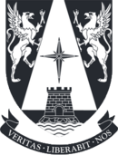

# MIA_SimulaciónAgentes 
    
Repositorio creado para el **Curso de Simulación Basada en Agentes** en el programa de Magister en Inteligencia Artificial de la Universidad Adolfo Ibáñez.

Profesor: Enrique Canessa. Facultad de Ingeniería y Ciencias, UAI.

**Eduardo Carrasco Vidal**
 

## Tareas Desarrolladas en el Curso:

[**Informe Final - Grupo 1: Enjambre de UAV para I.S.R. en operaciones de Fiscalización Pesquera**](https://github.com/educarrascov/MIA_SimulacionAgentes/blob/main/Tarea/Informe_Final_Proyecto_ABM_Grupo_1.pdf).

